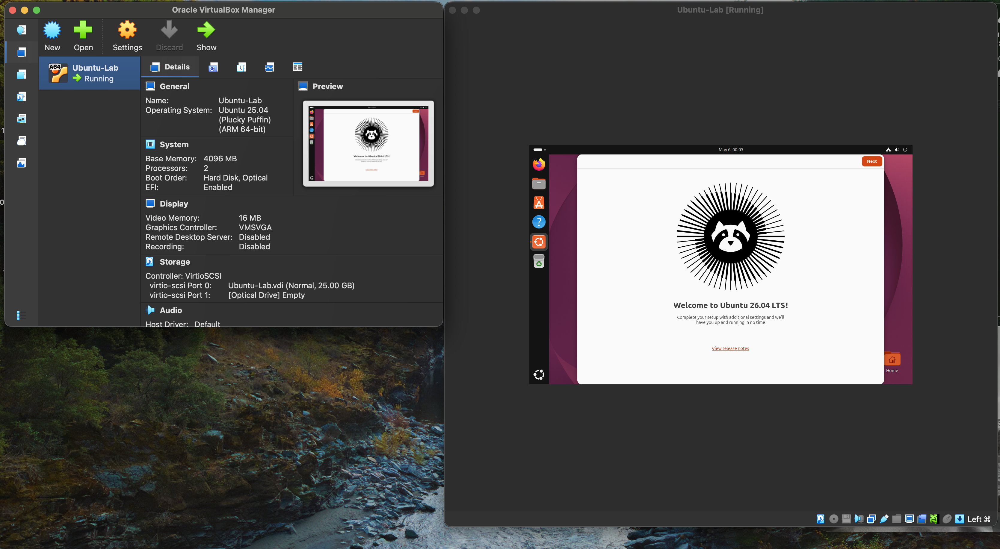
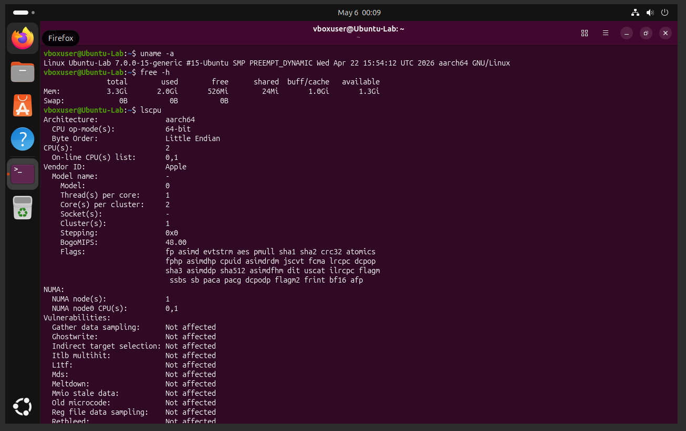

# CompTIA A+ Home Lab — Troubleshooting & Hardware Log
### Florian Razvan Cirstea | comptia-aplus-lab

## About This Repository

This repository documents hands-on hardware and troubleshooting work completed as part of my CompTIA A+ studies. All tasks were performed on real devices.

**Certification:** CompTIA A+ — Completed June 2024  
**Verify:** https://cp.certmetrics.com/comptia/en/public/verify/credential/3Z0N49FZFBRQQPGW

---

## 1. RAM Upgrade — Desktop PC

**Symptom:** System running slowly, unable to run multiple applications simultaneously.

**Diagnosis:** Identified that the system had only 2GB of RAM — insufficient for modern workloads.

**Solution:**
- Identified compatible RAM module by checking motherboard specifications
- Safely powered down the system and discharged static electricity before opening the case
- Located the RAM slots on the motherboard and removed the existing 2GB stick
- Installed an additional 2GB RAM stick, ensuring it was fully seated in the slot
- Powered on the system and verified the upgrade via System Properties (4GB total recognised)

**Result:** System performance improved significantly. Multi-tasking became stable.

**Skills demonstrated:** Hardware installation, static discharge safety, POST verification, RAM compatibility

---

## 2. CPU Overheating — Thermal Paste Replacement

**Symptom:** PC experiencing thermal throttling, high CPU temperatures, unexpected shutdowns under load.

**Diagnosis:** Identified that the original thermal paste had dried out and was no longer conducting heat effectively between the CPU and heatsink.

**Solution:**
- Powered down the system and removed the CPU cooler/heatsink
- Cleaned old thermal paste from both the CPU surface and heatsink base using isopropyl alcohol
- Applied a small pea-sized amount of fresh thermal paste to the centre of the CPU
- Reseated the heatsink, ensuring even pressure and secure mounting
- Monitored CPU temperatures after boot to confirm improvement

**Result:** CPU temperatures dropped significantly. System became stable under load with no further shutdowns.

**Skills demonstrated:** Thermal management, CPU cooler removal/installation, hardware maintenance, temperature monitoring

---

## 3. PS5 Disc Drive Installation — Digital to Disc Edition Upgrade

**Symptom:** PS5 Digital Edition — no ability to play physical disc games.

**Diagnosis:** Device shipped without a disc drive. Sony introduced an official disc drive upgrade for Digital Edition consoles.

**Solution:**
- Researched compatibility and confirmed the correct official disc drive model for the console
- Followed manufacturer disassembly procedure — removed side panels and located the disc drive bay
- Connected the disc drive module and secured all connectors
- Reassembled the console and powered on
- Completed firmware update prompted by the system to activate the disc drive

**Result:** Disc drive fully functional. Console now supports physical media.

**Skills demonstrated:** Consumer hardware disassembly, firmware updates, component installation, manufacturer documentation

---

## 4. Internet Connectivity Troubleshooting

**Symptom:** No internet connectivity on home network — multiple devices affected.

**Diagnosis:** Systematic troubleshooting to isolate whether the issue was physical, router-level, or ISP-related.

**Solution:**
- Checked all physical cable connections (modem, router, ethernet)
- Performed router reboot — powered off for 30 seconds, powered back on
- On Windows PC, ran `ipconfig` to check if a valid IP address was assigned
- Used `tracert` to identify where packets were being dropped in the route
- Ran `ipconfig /flushdns` to clear the DNS cache and resolve potential DNS resolution issues
- Confirmed internet restored and tested connectivity across multiple devices

**Result:** Connectivity restored. Issue was identified as a DNS cache problem combined with a router requiring a reboot.

**Skills demonstrated:** Network troubleshooting methodology, ipconfig, tracert, flushdns, physical layer inspection, OSI model awareness

---

## 5. Data Backup — iPhone System Backup

**Symptom:** Required a full system backup before performing an iOS update to prevent data loss.

**Diagnosis:** Identified risk of data loss during major OS update without a verified backup.

**Solution:**
- Connected iPhone to Mac via USB
- Opened Finder (macOS) and selected the device
- Chose "Back Up Now" to create a full encrypted local backup
- Verified backup completion and confirmed backup date/time
- Proceeded with iOS update, confirmed all data intact after restore

**Result:** Full backup completed successfully. Data preserved through OS update with zero data loss.

**Skills demonstrated:** Mobile device management, backup procedures, iOS/macOS integration, data protection best 
practices

---

## 6. Virtual Machine Lab — Ubuntu Linux on VirtualBox

**Objective:** Set up a virtualisation environment to simulate real IT infrastructure.

**Setup:**
- Installed Oracle VirtualBox on my macOS 
- Downloaded Ubuntu 26.04 LTS ARM64 ISO
- Created VM with 4GB RAM, 2 CPUs, 25GB virtual disk
- Completed full Ubuntu installation via unattended setup

**Verified:**
- OS: Ubuntu 26.04 LTS (Linux kernel 7.0, aarch64)
- RAM: 3.3GB available
- CPU: 2 cores, Apple Silicon (ARM64)
- Connected to internet and fully operational

**Skills demonstrated:** Virtualisation, VM creation, Linux installation, hardware allocation, VirtualBox

**Screenshots:**
- 
- 
